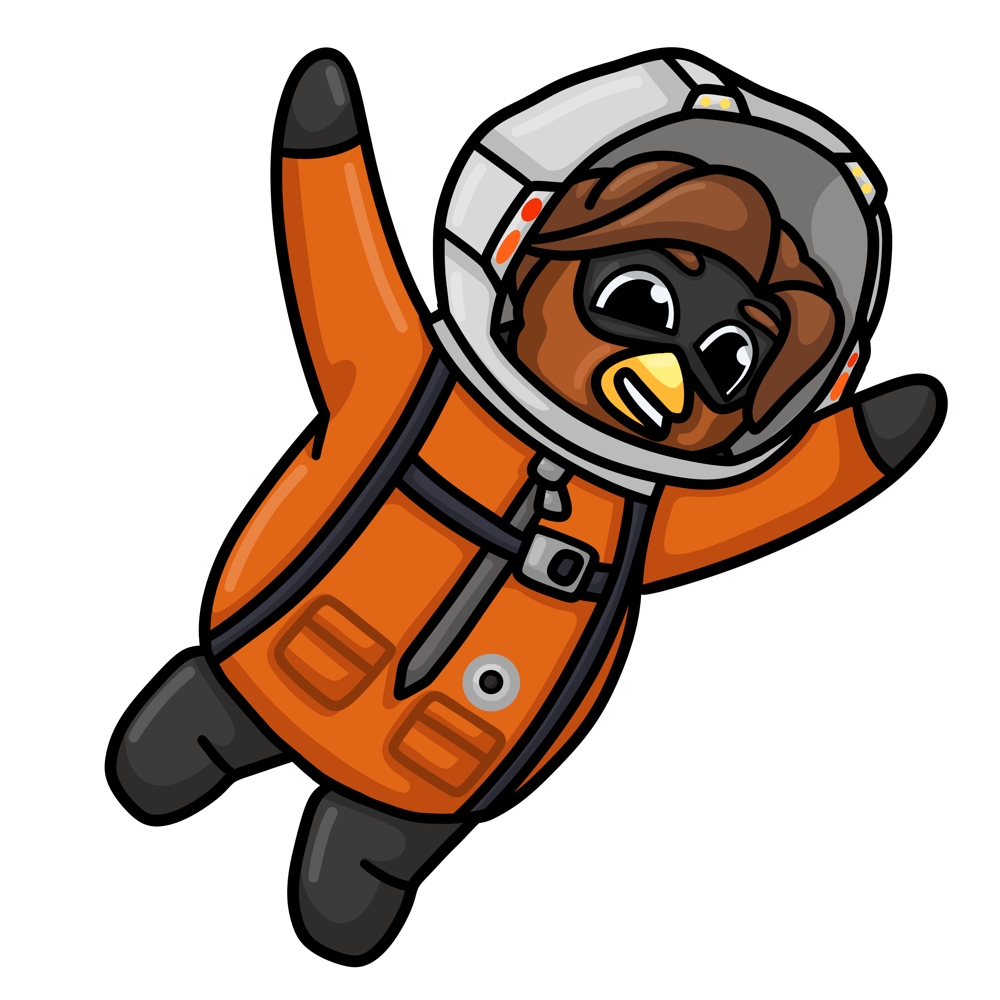
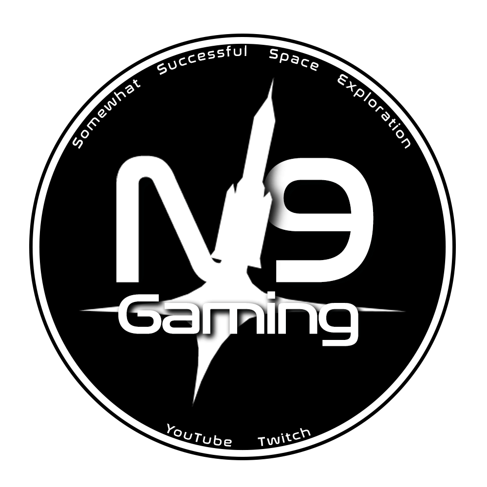

    

    
    
    

---

### Contents

1.  [Overview](#the-ultimate-realism-overhaul-modpack)
2.  [Installation](#installation)
3.  [The Series](#check-out-the-series)
4.  [Discord](#discord)

## The ultimate Realism Overhaul modpack

Installing Realism Overhaul and its career mode RP-1 Realistic Progression can be overwhelming to begin with.
Knowing which part mods and visual overhauls to add only complicates matters further, let alone the fact that many mods are not properly configured for RP-1. Historically, only determined or experienced modders have attempted to build an install and enjoy this incredible experience.
**But no more!**
As featured in the multiplayer Youtube series of the same name, the **For All Kerbalkind** modpack aims to make installing a stable and balanced RO/RP-1 experience a _small step_, rather than a _giant leap_.
 

## Installation

---

#### 1) Create a clean install of Kerbal Space Program 1.12.3

Create a new install by copying and pasting your KSP directory (usually found in **Steam/steamapps/common/**), then giving it a relevant name.

1.12.5 _should_ work if you didn't buy the game through Steam and are completely unable to roll back the version, but no guarantees.

#### 2) [Download CKAN](https://github.com/KSP-CKAN/CKAN/releases)

I like to place it inside the newly created KSP directory, but it can be run from anywhere.

#### 3) Download the latest release of this modpack

The latest release can be found on the right hand side of this page.

Download it and extract the contents into a convenient location.

#### 4) Run CKAN

Run CKAN, then ensure that you have the correct KSP instance targeted by going to

**File -> Manage game instances -> New game instance -> Add instance to CKAN**

then select the **buildID64** file inside your new KSP directory.

#### 5) Install the modpack

Go to

**File -> Install from .ckan**

then select the **ForAllKerbalkind.ckan** file inside the modpack folder.

### !!! DO NOT INSTALL ANY OF CKAN'S RECOMMENDATIONS OR SUGGESTIONS !!!

De-select all of them with the option in the bottom left of the window.

After pressing continue, it will take a while to download all the mods.

#### 6) [Install RP-1 v1.13.2.2](https://github.com/KSP-RO/RP-1/releases/tag/v1.13.2.2)

This has to be installed manually as CKAN prevents you installing this version despite it working perfectly.

Extract and copy the _contents_ of **GameData** into the **GameData** folder in your KSP directory.

#### 7) [Install Raiz's MAKS Spaceplane](https://www.dropbox.com/s/9a03cltqmga0uqq/MAKS.zip?dl=0)

Extract and copy the _contents_ of **GameData** into the **GameData** folder in your KSP directory.

#### 8) [Install Space Shuttle System Expanded](https://github.com/SpaceODY/Space-Shuttle-System-Expanded/releases)

Extract and copy the _contents_ of **GameData** into the **GameData** folder in your KSP directory.

#### 9) [Install Mouse Aim Flight](https://legacy.curseforge.com/kerbal/ksp-mods/mouse-aim-flight/files)

Extract and copy the _contents_ of **GameData** into the **GameData** folder in your KSP directory.

#### 10) [Install BDB LRV](https://spacedock.info/mod/442/Bluedog%20Design%20Bureau/download)

Adds a much better lunar rover than the default RO one.

Extract then **delete** **_everything_** except for the **GameData/Bluedog_DB/Parts/Apollo/LRV** folder.

Then copy **Bluedog_DB** into the **GameData** folder in your KSP directory.

#### 11) [Install Ven's Stock Revamp Antenna](https://github.com/Kerbas-ad-astra/Stock-Revamp/releases)

Adds an excellent Soviet antenna model.

Extract then **delete** **_everything_** except for the **GameData/VenStockRevamp/Squad/Parts/ScienceParts** folder.

Then copy **VenStockRevamp** into the **GameData** folder in your KSP directory.

#### 12) Run the game

Run **KSP_x64.exe** in your KSP directory and ensure you can reach the main menu. This may take a long time, but if it keeps crashing or you get stuck on an endless black loading screen you have gone wrong somewhere. Restart from step 1 and make sure you haven't missed anything.

#### 13) OPTIONAL - [Install Blackrack's TUFX Profile](https://drive.google.com/file/d/1zCqxMuG4nyQJlpVshsWkiyCdSi-1Wswj/view)

Adds a post-processing profile that works great with the **Deferred** mod packaged with the modpack.

Copy the file into the **GameData** folder in your KSP directory.

Once in-game, click the **TUFX** icon on the toolbar and select the **Blackrack_TUFX** profile.

#### 14) OPTIONAL - [Install Ballisticfox's RSS Reborn](https://github.com/RSS-Reborn/RSS-Reborn/wiki/Installation)

**Only recommended for powerful computers with a minimum of 16 GB of RAM**.
Adds incredible planet textures clouds, and weather effects. Useable with or without [Blackrack's volumetric clouds](https://www.patreon.com/blackrack/posts).

Download the **automatic installer**, place it in your KSP directory and run it.

Enable and select the zip of Blackrack's volumetric clouds if you have them.

Change the **Earth** textures to **16k** and leave everything else as default. **Higher resolutions will eat tens of GB of memory and our base statics will not display properly**, but up to you if you want to see the individual blades of grass at Cape Canaveral.

#### 15) Install modpack configuration

Copy the contents of the **GameData** folder in the For All Kerbalkind modpack folder into the **GameData** folder in your KSP directory.

Fixes several bugs, tweaks the tech tree and balance, and adds RO/RP-1 support for mods, custom spacesuits, gold sun visor, bases, flags, and more!

#### 16) Prune unused parts

Boot up the game, create a new save, and head into the **VAB**. Click the icon of two crossed brooms in the bottom right to open **Janitor's Closet**. Click **Export/Import**, then **Import**, then **For All Kerbalkind.prnlst**. The correct directory should open by default, but if you can't see the file then navigate to your KSP Directory, then **GameData/JanitorsCloset/PluginData**.

After selecting the file, click the brooms icon again, then **PermaPrune**. This prevents the hundreds of unused mod parts from being loaded, drastically improving load times. This is easily reversible if necessary.

#### 17) Hide non RP0 parts

Create an empty folder in your KSP directory **GameData** folder named **NoNonRP0**. This will hide all parts that cannot be pruned but are not configured for RO/RP-1 or are otherwise useless, to declutter your editor and tech tree.

## Check out the series!

    

        
<strong>The Beardy Penguin</strong>

        
        
Kaputnik Design Bureau (USSR)

    

    

        
<strong>N9 Gaming</strong>

        
        
The Astral Foundation (USA)

    

    

        
<strong>Carnasa</strong>

        
        
CSC (UKSA/ESA)

    

## Discord

If you've followed the readme and still need more help, come along to one of our discords:

### [Beardy's discord](https://discord.gg/VNUARRswWX)

### [N9's discord](https://discord.gg/n9gaming)

### [Carnasa's discord](https://discord.gg/cYeXTeNBe8)
